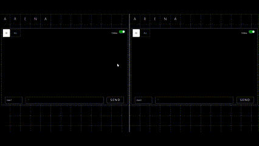

# Chat Functionality using WebSocket
Tech stack used: ```Spring Boot```  ```HTML/CSS/JS```
Protocol: ```STOMP```

Steps to run:
1. Run Spring Boot Code
2. This starts on ```ws://localhost:8080/chat``` by default
3. Next Start Frontend code on a server, currently I use VSCode's live server
4. Once started, open ```http://localhost:5500``` or whatever port your vscode starts for you.
5. Voila! Enter your name and get going.

# Current Limitations:
1. There is only one global chat for all users, so all users who join can send a message.
2. Some features like Available users are currently bugged.
3. Need to improve look and feel.

# Features
1. Chat with All using the application
2. Shows the user typing

# Demo

